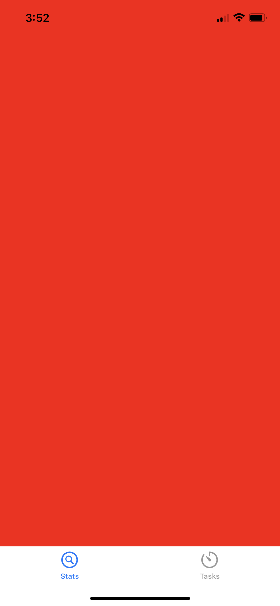
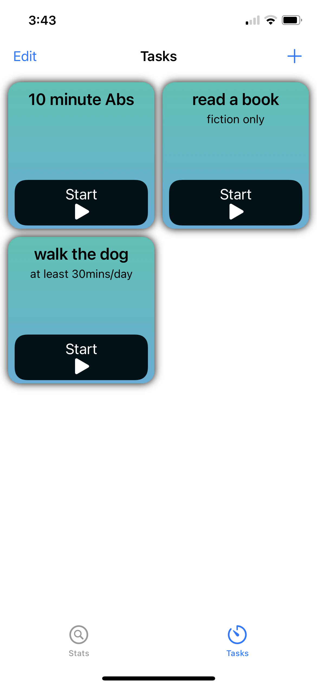

# READ ME
The goal is to allow users to track how long they spend on certain tasks. Below is the current UI for the Tasks view.

---

## Points of Interest
- timers/tracking are not functional yet
- to delete a task, tap "Edit" and then the task you want to delete (this is not the final design, but the current functionality)
---

