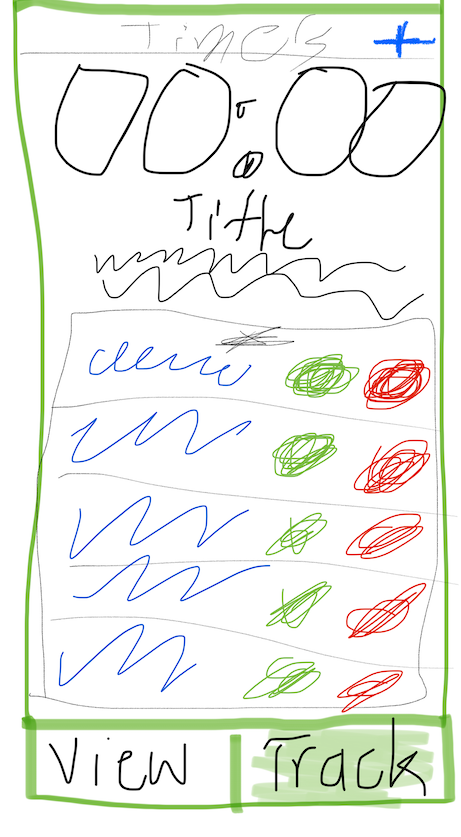

# READ ME
The goal is to allow users to save and reuse common timers they may set. A side effect is that we can provide lite metrics on what tasks they timed.

Please enjoy this crudely sketched design. You're looking at a tab bar style navigation controller where "View" is a user's metrics and "Track" is a view of all the users timers.

